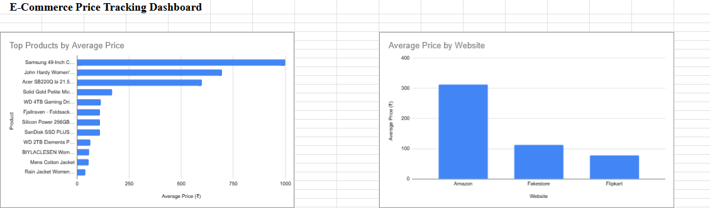
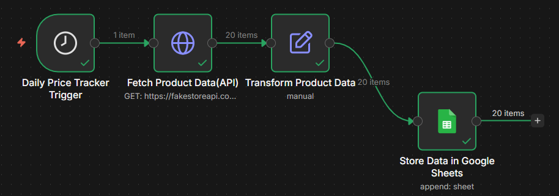

# E-Commerce Price Tracking Dashboard (n8n + Google Sheets)

## Project Overview

This project demonstrates an end-to-end **data pipeline and analytics dashboard** for tracking product prices across multiple e-commerce platforms.

It uses **n8n** for workflow automation, **Google Sheets** for data storage, and **pivot tables & charts** to create a business-ready dashboard.

---

##  Project Screenshots

### Dashboard View



### n8n Workflow



---

## Key Features

* Automated data pipeline using n8n
* Data extraction via API (FakeStore API / simulated data)
* Data transformation using Set Node
* Structured storage in Google Sheets
* KPI tracking:

  * Total Products
  * Average Price
  * Maximum Price
  * Minimum Price
* Product-wise price comparison
* Platform-wise comparison (Amazon, Flipkart, Fakestore)
* Visual dashboards using charts and pivot tables

---

## Tech Stack

* **n8n** – Workflow automation
* **Google Sheets** – Data storage & dashboard
* **Pivot Tables & Charts** – Data analysis & visualization

---

## Workflow Architecture

```text
Daily Price Tracker Trigger
        ↓
Fetch Product Data (API)
        ↓
Transform Product Data
        ↓
Store Data in Google Sheets
```

---

## Dashboard Components

### KPI Section

* Total number of products
* Average product price
* Highest priced product
* Lowest priced product

### Product Comparison Chart

* Displays average price per product
* Helps identify expensive vs affordable items

### Website Comparison Chart

* Compares average price across platforms
* Useful for identifying cheaper marketplaces

---

## Insights Generated

* Price distribution across products
* Platform-wise pricing trends
* Identification of cost-effective platforms
* Detection of high-value vs low-cost products

---

## Note

* The current data source is **simulated / API-based (FakeStore API)**
* The system is designed to be scalable and can be extended to:

  * Real-time e-commerce APIs
  * Web scraping
  * Price drop alerts (email/notifications)

---

## Future Enhancements

* Price drop alert system
* Integration with real APIs (Amazon, Flipkart, etc.)
* Advanced dashboard filters (category, date, platform)
* Fully automated pipeline without manual edits

---

## Author

Sheeba Rashid


